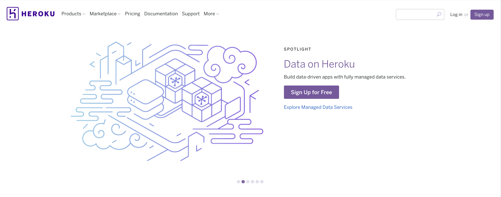
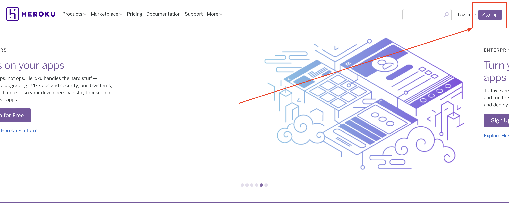
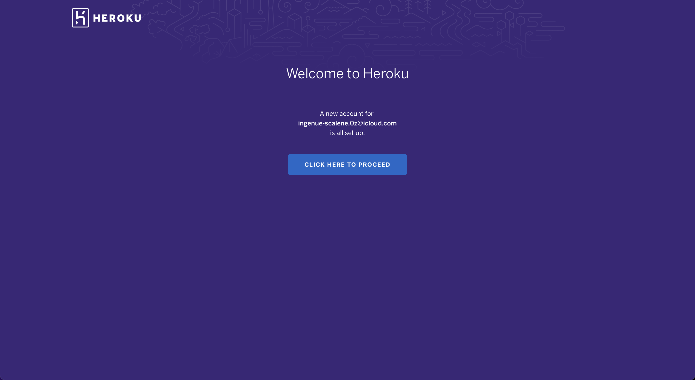
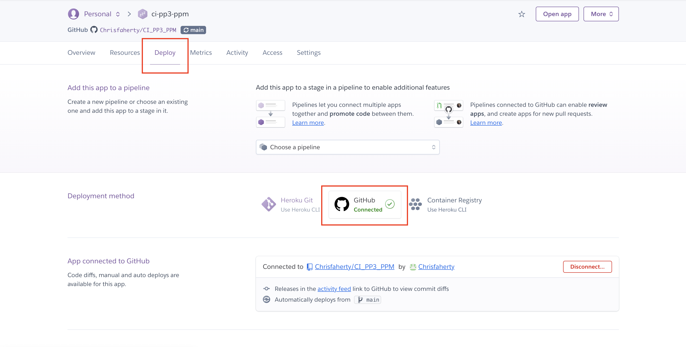
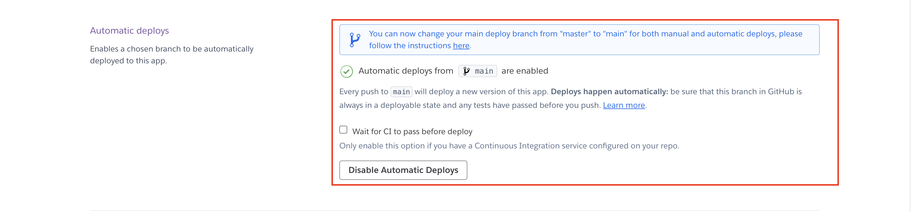
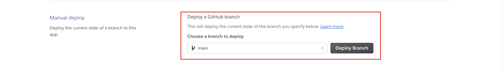

<h1 align="center">NFT Social Hub Django Rest Framework API - Project Portfolio 5</h1>

## - By Christopher Faherty

### [View the live project here](https://ci-nft-social-hub.herokuapp.com/) #
### [View the deployed API here](http://ci-nft-social-hub-api.herokuapp.com/) #
### [View the API repository here](https://github.com/Chrisfaherty/ci-nft-social-hub-api) #

# Table of Contents:
1. [User Stories](#user-stories)
2. [Database Model Structure](#database-model-structure)
3. [Languages and Technologies Used](#languages-used)
4. [Testing](#testing)
    - [Validation](#validation)
5. [Bugs and fixes](#known-bugs)
6. [Credits](#credits)

## User Stories

From the backend perspective of this API, the user stories are CRUD focused and authentication focused.
1. As an admin, I want create functionality of all profiles, posts, likes, comments and subscriptions.
2. As an admin, I want update functionality of all profiles, posts, likes and comments so that I can edit any content I choose to.
3. As an admin, I want delete functionality of all profiles, posts, likes and comments so that I can delete any content that may be deemed as harmful.

## Database Model Structure

### Profile Model

- This model is directly linked in a one to one relationship with the User model, imported from django-allauth.
- The Profile model contains all fields that are associated with a profile when a user creates one. These fields are as such:
1. owner = OneToOne with User field
2. created_at = DateTimeField
3. updated_at = DateTimeField
4. name = CharField
5. content = TextField
6. image = ImageField with default profile image

### User Model

- This model is imported from django-allauth, and is integrated within all functional model classes.
- The User model contains multiple fields associated with all foreign models within my app:
1. Profile model = owner field holds OneToOne relationship with User
2. Posts model = owner field holds ForeignKey relationship with User
3. Likes model = owner field holds ForeignKey relationship with User
4. Followers model = owner & followed fields hold ForeignKey relationship with User which are related to following & followed
5. Comments model = owner field holds ForeignKey relationship with User

### Post Model

- The Post model contains all fields that are associated with a post when a logged in user creates one. These fields are as such:
1. owner = ForeignKey with User field
2. created_at = DateTimeField
3. updated_at = DateTimeField
4. title = CharField
5. category = CharField
6. content = TextField
7. image = ImageField with default post image
8. website = URLField
9. social = URLField
10. marketplace = URLField 

### Follower Model

- The Follower model contains all fields that are associated when a logged in user attempts to follow another profile, as such:
1. owner = ForeignKey with User field
2. followed = ForeignKey between User field and followed field
3. created_at = DateTimeField

### Like Model

- The Like model contains all fields that are associated when a logged in user attempts to like a created post, as such:
1. owner = ForeignKey with User field
2. post = ForeignKey between Post model field and likes field
3. created_at = DateTimeField

### DisLike Model

- The DisLike model contains all fields that are associated when a logged in user attempts to dislike a created post, as such:
1. owner = ForeignKey with User field
2. post = ForeignKey between Post model field and likes field
3. created_at = DateTimeField

### Comment Model

- The Comment model contains multiple fields associated with content related to comments, as such:
1. owner = owner field holds ForeignKey relationship with User model
2. post = post field holds ForeignKey relationship with Post model
3. content = TextField for comment input
4. created_at = DateTimeField
5. updated_at = DateTimeField

### Subscribers Model

- The Subscribers model contains multiple fields associated with content related to subscriptions, as such:
1. fullname = CharField
2. email = EmailField
3. date = DateTimeField

### SubscribersMessage Model

- The SubscribersMessage model contains multiple fields associated with content related to subscription messages, as such:
1. fullname = CharField
2. email = EmailField
3. date = DateTimeField
4. title = CharField
5. message = TestField

## Languages and Technologies Used

- This project was created using the python programming language, 

- The API for this project was created using Django. The batteries included nature of this framework allowed for rapid development of the API.

### Tools Used

- [Gitpod](https://gitpod.io/) my preferred coding environment.
- [GitHub](https://github.com/) to store my code repositories.
- [Git](https://git-scm.com/) was used to commit and push the code changes.
- [Heroku](https://dashboard.heroku.com/apps) used to host the  repositories and deploy the API.
- [Django Rest Framework](https://www.django-rest-framework.org/) was used in many instances to add features to the API.
- [Django API Testing](https://www.django-rest-framework.org/api-guide/testing/) was used to create tests and run them to test the API.
- [Cloudinary](https://cloudinary.com/) was used to store the static files.
- [PostgreSQL](https://www.postgresql.org/) was used to store the data inside my relational database.
- [Pillow](https://python-pillow.org/) was used for image input validation (resolution and dimension filtering).
- [Psycopg2](https://pypi.org/project/psycopg2/) database adapter for Python.

## Testing

In order to ensure my API was functioning correctly, both manual and automated tests were run. 

### Validation

- [PEP8 Linter](https://pep8ci.herokuapp.com/) PEP8 linter to ensure the code was PEP8 compliant and  validated. Every .py file was tested of which all passed with success.

### Manual Testing of User Stories

1. As an admin, I want create functionality of all profiles, posts, likes and comments,
2. As an admin, I want update functionality of all profiles, posts, likes and comments,  so that I can edit any content I choose to.
3. As an admin, I want delete functionality of all profiles, posts, likes and comments so that I can delete any content that may be deemed as harmful.
4. As an admin, I want to be able to let users subscribe to an email list to get updates on new features.
5. As an admin, I want users to be able to send a message to admin if they require assistance.

| # | Test | Functionality | Expected Action | Actual Action |
| --- | --- | --- | --- | --- |
| 1 | User | CRUD functionality of a User | A User can be created, read, updated or deleted | This works correctly |
| 2 | Profile | Create, read and update functionality of a Profile | A Profile can be created, read, updated for a User | This works correctly |
| 3 | Posts | CRUD functionality of a Post | A Post can be created, read, updated or deleted for a User | This works correctly |
| 4 | Likes | Create and delete functionality for likes | A Like can be added or removed from a post if a user is logged in (cannot like own post or like and dislike the same post) | This works correctly |
| 5 | DisLikes | Create and delete functionality for Dislikes | A DisLike can be added or removed from a post if a user is logged in (cannot Dislike own post or like and dislike the same post) | This works correctly |
| 6 | Follower | Create and delete functionality for followers | A Follow can be added to a user or removed (has to be logged in) | This works correctly |
| 7 | Comments | CRUD functionality of a comment | A Comment can be created, read, updated or deleted associated with a post (has to be own comment) | This works correctly |
| 7 | Subscription | Create and delete functionality of a subscriber | A user can subscribe to receive updates on new features | This works correctly |
| 8 | Subscription Message | Create and delete functionality of a message | A message can be created and sent to the admin to get in touch if there are any issues | This works correctly |

<strong>The table above addresses all of my user stories, including the create, update and delete functionality of all aspects of my website. </strong>

As well as this: likes, comments, posts, following and subscriptions messages are only able to be created by authenticated users that are signed into their account. Subscriptions can be sent by users that are not signed into their account. Profiles that have created content are the only profiles authenticated to edit and remove the content they have created (other than admins).

<strong>#1 User and Profile Creation Test Screenshots</strong>

1. Creating a profile with username and password

2. Showing the new user exists

3. Showing the new profile exists

<strong>#2 Profile Edit and Deletion Test Screenshots</strong>

1. Adding content to edit profile

2. Profile edited successfully

3. Delete profile confirmation

4. Profile deleted successfully

<strong>#3 Posts Create, Edit and Deletion Test Screenshots</strong>

1. Creating post

2. Editing post
 
3. Edited post with new content and title (same post id)

4. Delete post confirmation

5. Deleted post (204 No Content on old post id)

<strong>#4 Like and Unlike Test Screenshots</strong>

1. List of all posts to like

2. Liking post (201 Created)

3. Unlike post confirmation

4. Deleted like (204 No Content on old like id)

<strong>#5 DisLike and UnDislike Test Screenshots</strong>

1. List of all posts to dislike

2. DisLiking post (201 Created)

3. UnDislike post confirmation

4. Deleted Dislike (204 No Content on old Dislike id)

<strong>#6 Follow and Unfollow Test Screenshots</strong>

1. List of all followers

2. Followed profile

3. Unfollow confirmation

4. Deleted follow (204 No Content on old followers id)

<strong>#7 Comments Create, Edit and Deletion Test Screenshots</strong>

1. List of all comments

2. Created comment on a post

3. Edited comment

4. Comment deletion confirmation

5. Deleted comment (204 No Content on old comments id)

<strong>#8 Subscriptions Create and Delete, 
Test Screenshots</strong>

1. List of all subscriptions

2. Created a subscription

3. Subscription deletion confirmation

4. Deleted subscription (204 No Content)

<strong>#9 Subscriptions message Create and Delete, 
Test Screenshots</strong>

1. List of all subscription messages

2. Created a subscription message

3. Subscription message deletion confirmation

4. Deleted subscription message (204 No Content)

## Known Bugs

There were a few bugs that I came across while coding up this API. Some of which were:
-  The project was created in the wrong directory which was giving a ModuleNotFoundError.
	* This was resolved by relocating the main project into the correct directory.
-  Restricting users from logging out of the application.
	* This was resolved by importing the logout_route into the urls.py.
- Issue impacting access to the profiles.
	* This was due to a typo in the api url in profiles/views.py.
	

## Deployment

### Deploying to Heroku
* Go to the heroku.com site.
    

Screenshots

    
    

* Click the signup button in the top right.
    

Screenshots

    
    

* Create an account on heroku.com,
    

Screenshots

    
    

* Confirm your account in the email heroku sent to your inbox,
    

Screenshots

    
    

* Create a password,
    

Screenshots

    
    

* Click and proceed,
    

Screenshots

    
    

* Accept the terms of service,
    

Screenshots

    
    

* Create a new app, create a name for your app "ci_pp3_ppm" and choose your region,
    

Screenshots

    
    

* Go to the settings section,
    

Screenshots

    
    

* Click Reveal Config Vars,
    

Screenshots

    
    

* Input your Config Vars for the project.
    

Screenshots

    
    

* In the build packs section click add buildpack. For this project, I added  'Python' as the build pack.
    

Screenshots

    
    

* Go to "Deploy" in "Deployment method" select "GitHub",
    

Screenshots

    
    

* Click 'Search' (Enter in your projects name that you have in your github repositry)and then 'Connect'. This project is connected to Chrisfaherty/ci-nft-social-hub-api.
    

Screenshots

    
    

* Choose the branch you want to buid your app from "main" .
* If prefered, click on "Enable Automatic Deploys", which keeps the app up to date when you push to git hub. Automatic deployments is turned on for this project.
    

Screenshots

    
    

* If the project doesn't deploy after selecting automatic deploy . In the Manual deploy section click Deploy Branch to deploy your code, this is what I had to do.
    

Screenshots

    
    

* Once the code is deployed it will show a button that you can click to view the deployed site. Then the project has sucessfully been deployed.

### Connecting to ElephantSQL
* Log in to ElephantSQL.com to access your dashboard
    

Screenshots

    
    

* Click "Create New Instance"

* Set up a plan
    

Screenshots

    
    

* Click "Select Region"

* Select a data center near you
    

Screenshots

    
    

* Then click "Review"

* Check your details are correct and then click "Create Instance"
    

Screenshots

    
    

* Return to the ElephantSQL dashboard and click on the database instance name for this project
    

Screenshots

    
    

* Copy the database url for your project, as we’ll need it in the next step
    

Screenshots

    
    

* Now to connect the database up to heroku

* Log into heroku and go to the app you created earlier

* Go to the Settings tab
    

Screenshots

    
    

* Click Reveal Config Vars
    

Screenshots

    
    

* Add a Config Var called DATABASE_URL. Paste your ElephantSQL database URL in as the value
    

Screenshots

    
    

* Back in gitpod in your env.py file add a new key, DATABASE_URL, and give it a value of the copied database URL
    

Screenshots

    
    

* Install the dj-database-url package version 0.5.0 in the terminal with pip3. This will allow us to parse the URL we got above to a format Django can work with:
    

Screenshots

    
    

* and remember to add it to your requirements.txt with
    

Screenshots

    
    

* At the top of settings.py, import the package and the env.py file
    

Screenshots

    
    

* In settings.py, comment out the default database setting and replace it to use the DATABASE_URL environment variable. Your code should now look like this
    

Screenshots

    
    

* Run the migrate command in the terminal to build the database according to the model structure we created in earlier videos
    

Screenshots

    
    

### Connecting to Cloudinary

* Visit https://cloudinary.com
* Click on the Sign Up For Free button
* Provide your name, email address and choose a password
* For Primary interest, you can choose Programmable Media for image and video API
* Click Create Account
* Verify your email and you will be brought to the dashboard
* In your Dashboard copy your "API Environment vairable"
* Go back to your gitpod and in your env.oy file add a line for your API key and paset it in.
* os.environ["CLOUDINARY_URL"]="YOUR API KEY"
* The API is also to be input into Heroku config vars
* Back in your settings.py file go to the installed apps section and add in the following cloudinary lib'cloudinary_storage','django.contrib.staticfiles','cloudinary',
* Down at the bottom of the setting py files add these lines of code. 
    * STATICFILES_STORAGE = 'cloudinary_storage.storage.StaticHashedCloudinaryStorage'
    * STATICFILES_DIRS = [os.path.join(BASE_DIR, 'static'), ]
    * STATIC_ROOT = os.path.join(BASE_DIR, 'staticfiles')
* Now to set up the media storage. add this code below the previous code in your settings.py file
    * MEDIA_URL = '/media/'
    * DEFAULT_FILE_STORAGE = 'cloudinary_storage.storage.MediaCloudinaryStorage'
* Now your cloudinary is set up.

### Forking the GitHub Repository
* Go to the GitHub repository,
* In the top right hand corner you can click on the fork button,
* This will fork the repositry.

## Credits
- Inspiration from this API was taken from the [Moments](https://github.com/Code-Institute-Solutions/drf-api) walkthrough project from Code Institute and helped within the guidance and steps of creating this API.

## Acknowledgements
I would like to take the opportunity to thank:
* My Mentor Mo Shami for the great feedback productive meetings and guiding me to finishing this project.
* I would also like to thank the Code institute team for all the support and material to assist with this project.
* The code institute Tutors for being available when ever guidance was required.
* I would like to thank Nick Coles & Chris Browning for the help with problem solving and independant reviews.